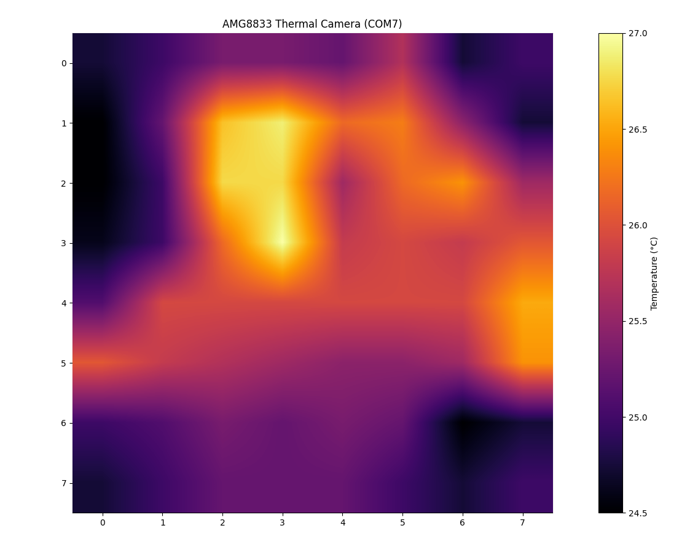
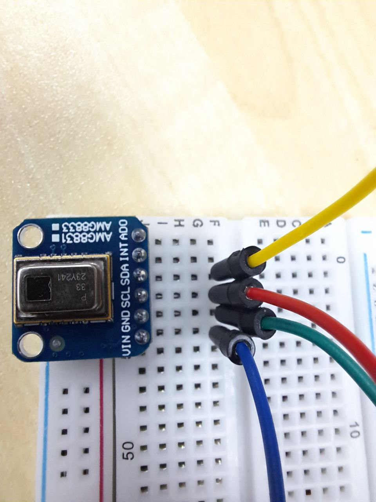
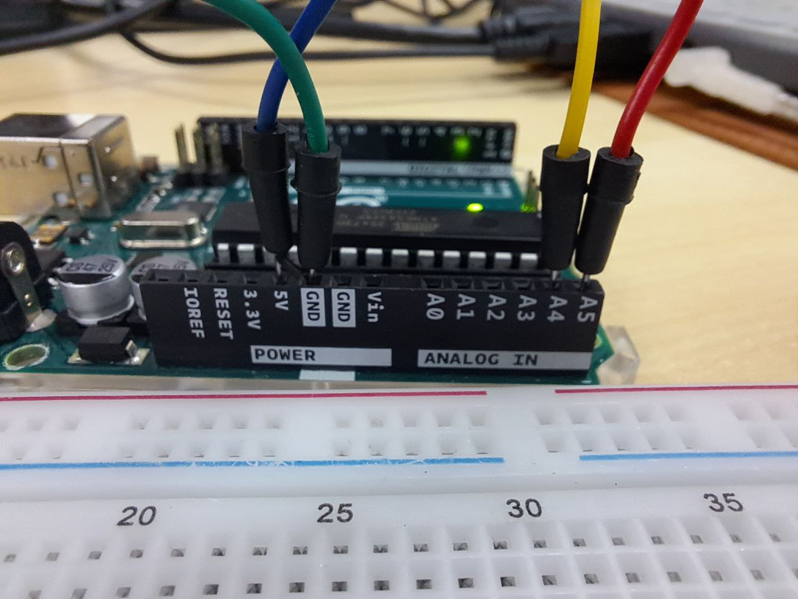

# 🔍 AMG8833 Thermal Camera Project  
*A DIY thermal imaging system built with Arduino and Python*  

  

*Here's a low resolution thumbs up for you!* 

## 🛠 **Hardware Setup**  
- **Components**:  
  - AMG8833 IR Sensor  
  - Arduino Uno  
  - Breadboard + Jumper Wires  

- **Wiring Guide**:  
   |   

## 💻 **Software**  
- **Arduino Code**: [amgthermalsensor.ino](Arduino/amgthermalsensor.ino)  
  - Reads 8x8 temperature data  
  - Sends CSV via Serial at 115200 baud  

- **Python Visualization**: [thermal_camera.py](Python/thermal_camera.py)  
  ```bash
  pip install pyserial matplotlib numpy
  python Python/thermal_camera.py
  ```

## 📚 **How It Works**  
1. AMG8833 → Arduino (I²C)  
2. Arduino → Python (Serial)  
3. Python → Real-time heatmap (Matplotlib)  

## 🌟 **Features**  
- Live temperature monitoring  
- Potential customizable threshold alerts, x-y coordinate mapping

## 🤝 **Contribute**  
Found a bug? Open an [Issue](https://github.com/drearyJaysmabirt/AMG8833-Thermal-Camera/issues)!
